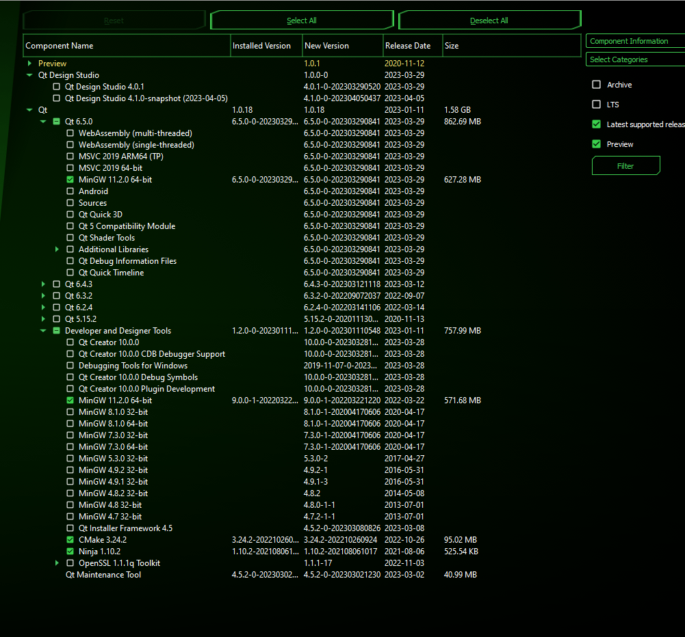
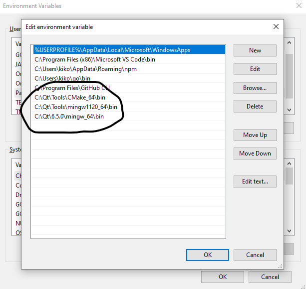

# Lab 9 - GUI

## Preparation

You will need several tools installed on your local environment to be able to develop a GUI application on Windows. Since most of you are working on windows, this guide will focus on this.

First and foremost, you must install [Git](https://git-scm.com/downloads) and [VS Code](https://code.visualstudio.com/download). Follow the installation instructions for both. 

Then proceed with installing the framework we will use for GUI development: https://www.qt.io/download-open-source. Follow the installer (you will have to create an account).

You will need the following components from the installer:




You don't need creator or the design studio - we will be working code-first.

Add the path to the `cmake` and `mingw` to your Path environment variable. You will also need to add the path to the Qt shared libraries, compiled for MinGW. You should have something similar setup for your `Path` environment variable:



> The paths in the picture above are using the default installation location of Qt: `C:\Qt\`. If you are not sure how to change your Path environment variable - Google it, it is easy.

You can test the setup by running the following commands in a terminal (you should NOT see error saying "unrecognized command):
```
git
cmake
g++
```

That is it. We can now start your first steps into GUI programming!

## Build

1. Step 1: Initially and whenever you add/remove files
```sh
cmake -G "MinGW Makefiles" -DQt6_DIR:PATH=C:\Qt\6.5.0\mingw_64\lib\cmake\Qt6 -B .\build\
```
> Replace the path to your Qt installation directory. the above assumes default location.

2. Step 2: Every time you make changes to the code
```sh
cd build
mingw32-make.exe
```